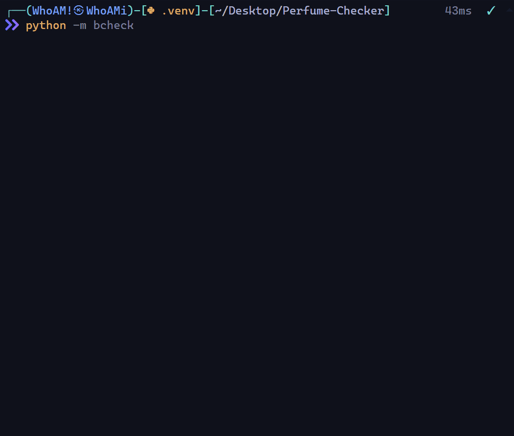
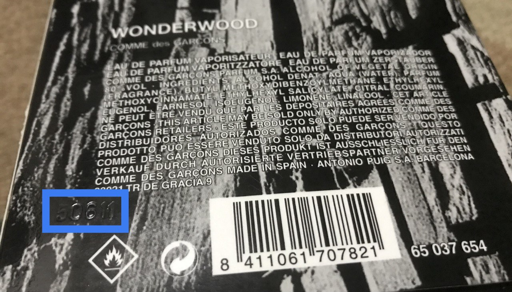

<div align="center">


**Perfume-Checker** is a tool to check the date of manufacture of perfumes.



</div>

## **Installation**

**Using** _`poetry`_

```
git clone https://github.com/x404xx/Perfume-Checker.git
cd Perfume-Checker
poetry shell
poetry install
```

**Using** _`pip`_

```
git clone https://github.com/x404xx/Perfume-Checker.git
cd Perfume-Checker
virtualenv env
env/scripts/activate
pip install -r requirements.txt
```

## Usage Example

```bash
python -m bchecker
```

> [!Note]
> **Use the UP/DOWN keys to select a brand, then press 'ENTER'**

## Batch Code



## **Legal Disclaimer**

> [!Note]
> This was made for educational purposes only, nobody which directly involved in this project is responsible for any damages caused. **_You are responsible for your actions._**
